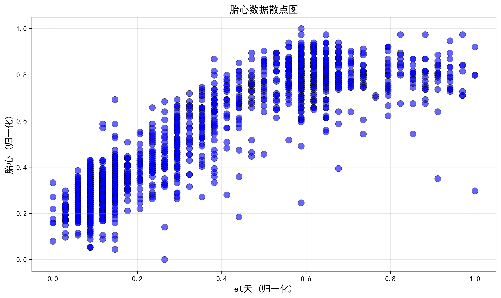
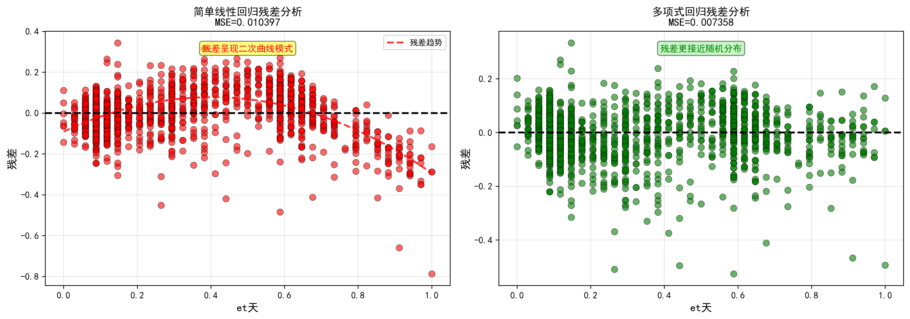

# 胎心数据回归分析

使用最小二乘法和梯度下降法对胎心数据进行二次多项式回归分析。

## 项目简介

本项目对胎心归一化数据进行回归分析，首先尝试了简单线性回归，发现存在系统性偏差后，通过多项式特征扩展使线性回归能够拟合非线性数据，并对比了最小二乘法和梯度下降法两种优化方法的性能。

## 环境要求

- Python 3.7+
- pandas
- numpy
- matplotlib
- scikit-learn
- openpyxl

安装依赖：
```bash
pip install pandas numpy matplotlib scikit-learn openpyxl
```

## 使用方法

1. 准备数据文件（Excel格式，包含两列：特征和标签）
2. 修改代码中的文件路径
3. 运行主程序：

```bash
python fetal_heart_regression_analysis.py
```

**线性回归对比分析**（可选）：
```bash
python linear_vs_polynomial_comparison.py
```

## 主要功能

### 1. 数据预处理
- 读取Excel数据
- 数据探索（散点图可视化）
- 多项式特征扩展（二次）

### 2. 模型训练
- **简单线性回归**：y = w₀ + w₁x（对比实验）
- **最小二乘法 (OLS)**：使用正规方程直接求解多项式回归
- **梯度下降法 (GD)**：迭代优化求解多项式回归

### 3. 性能评估
- 均方误差 (MSE)
- 决定系数 (R²)
- 参数对比
- 残差分析

### 4. 可视化
- 数据散点图
- 线性回归 vs 多项式回归对比
- 拟合曲线对比
- 收敛过程分析
- 残差分布对比

## 实验结果

### 数据特征
- 数据量：2000条
- 归一化方法：Min-Max归一化
- 数据分布：二次函数关系（倒U型）

### 数据散点图



从散点图可以清楚地看到数据呈现倒U型曲线，是典型的二次函数关系。

### 模型性能对比

| 方法 | R² | MSE | 说明 |
|------|-----|-----|------|
| 简单线性回归 | 0.8225 | 0.010397 | 存在系统性偏差 |
| 多项式回归（OLS） | 0.8744 | 0.007358 | 更准确的建模 |
| 多项式回归（GD） | 0.8744 | 0.007358 | 收敛后与OLS一致 |

**性能提升**：相比简单线性回归，多项式回归R²提升6.3%，MSE降低29.2%

### 线性回归 vs 多项式回归对比


左图为简单线性回归，中图为多项式回归，右图为两者叠加对比。可以看出直线无法完全拟合曲线数据。

### 残差分析



左图为线性回归残差，呈现明显的曲线模式（系统性偏差）；右图为多项式回归残差，接近随机分布（拟合良好）。

### 多项式回归完整分析


四合一对比图展示了：
- 最小二乘法拟合结果
- 梯度下降法拟合结果
- 两种方法对比（曲线几乎完全重合）
- 不同学习率的收敛过程对比

### 关键发现
1. 数据呈非线性分布，简单线性回归虽然R²达到0.82，但存在系统性偏差
2. 通过残差分析发现线性回归的残差呈现曲线模式，说明模型形式不匹配
3. 多项式特征扩展能显著改善拟合效果，残差接近随机分布
4. 梯度下降法需要合适的学习率和收敛阈值才能达到最优解
5. 不同学习率对收敛速度有显著影响
6. 两种优化方法最终得到的结果高度一致，验证了实现的正确性

## 文件说明

```
.
├── fetal_heart_regression_analysis.py    # 主程序
├── linear_vs_polynomial_comparison.py    # 线性回归对比程序
├── README.md                              # 项目说明
├── requirements.txt                       # 依赖列表
└── images/                                # 结果图片
    ├── data_scatter_plot.png
    ├── regression_analysis_results.png
    ├── linear_vs_polynomial_comparison.png
    └── residuals_comparison.png
```

## 算法对比

### 线性回归 vs 多项式回归

虽然简单线性回归的R²也达到了0.82，但由于数据本质是二次关系，线性回归存在系统性偏差。多项式回归通过特征扩展[1, x] → [1, x, x²]，能够更准确地建模数据生成过程。

**判断依据**：
- 散点图观察：数据呈倒U型曲线
- 残差分析：线性回归残差呈曲线模式，多项式回归残差随机分布
- 性能指标：多项式回归MSE降低29.2%

### 最小二乘法 vs 梯度下降法

| 方法 | 优点 | 缺点 | 适用场景 |
|------|------|------|----------|
| 最小二乘法 | 直接求解，快速精确，无需调参 | 需要计算矩阵逆，大数据集时计算量大 | 小到中等规模数据 |
| 梯度下降法 | 适用范围广，可处理大规模数据 | 需要调参，收敛速度依赖参数选择 | 大规模数据，在线学习 |
